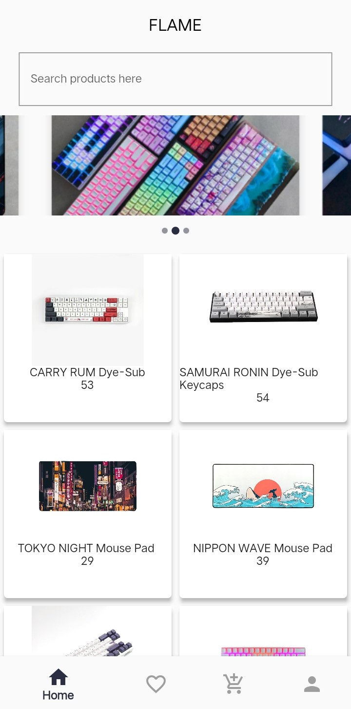
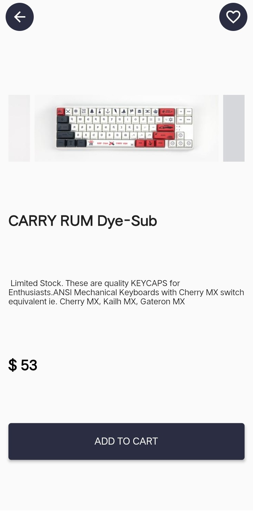

# flutter Ecommerce app : Flame

A flutter shopping application - Firebase backend + firebase cloud firestore + firebase cloud storage

Resources :

- [All the images used in the project is from :](https://www.millennialengineers.com)

Packages used:

- [flutter screenutil: ^5.0.0+2](https://pub.dev/packages/flutter_screenutil)
- [fluttertoast: ^8.0.8](https://pub.dev/packages/fluttertoast)
- [dots indicator: ^2.0.0](https://pub.dev/packages/dots_indicator)
- [carousel slider: ^4.0.0](https://pub.dev/packages/carousel_slider)

### Demo

<---------video--------------->

